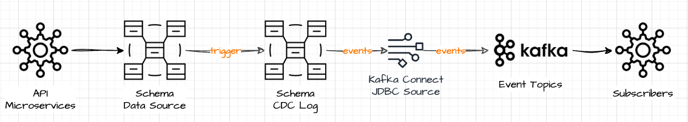

# Change Data Capture (CDC) with Timescale - Proof of Concept

This repository provides a fully containerized proof of concept (PoC) demonstrating a Change Data Capture (CDC) pipeline using TimescaleDB, Kafka, Kafka Connect, and the JDBC Source Connector.

The goal is to capture changes in a PostgreSQL/Timescale table or view and stream them as events into Kafka, where downstream consumers can react in real time.

## Architecture Overview




## 🐳 Containerized Components

### 🐘 TimescaleDB (timescaledb)
- https://www.timescale.com
- Runs PostgreSQL 17 with Timescale extension
- initialized with `timescale/init.sql`
- Exposed port: localhost:5432
- Credentials: postgres/password
- Database: demo
- 2 Schemas:
  - `dataschema` schema
    - `dataschema.assets` table with sample data
    - `dataschema.anomaly` hypertable with sample time series data
  - `cdc` schema
    - `cdc.cdc_log` hypertable that records row-level changes to the tables under surveillance.
    - `cdc.cdc_view_assets` view exposing changes from the assets table.

### 📦 Kafka (kafka)
- https://kafka.apache.org/
- KRaft mode (no Zookeeper)
- Acts as the message broker for the CDC events.
- Topic `cdc-event_log` will receive all the CDC records
- Topic `cdc-event_log_assets` will receive changes from the `assets` table

### 🔌 Kafka Connect (kafka-connect)
- https://kafka.apache.org/documentation.html#connect
- Uses the Aiven JDBC Source Connector mounted from `aiven-jdbc/`
- Configured via  `connectors/cdc-timescale-connector.json`
- Pulls new records from the CDC views
- Streams them to Kafka in timestamp+incrementing mode
- Management API http://localhost:8083

### 🌐 Kafka UI (kafka-ui)
- https://github.com/provectus/kafka-ui
- Web interface to browse topics, consumers, and events
- http://localhost:8080

### 🔁 Data Flow
1.	New or updated records are written to dataschema tables (`dataschema.assets` or `dataschema.anomaly`)
2.	A trigger writes a change record into `cdc.event_log`
3.	The `cdc.event_log_assets` view filters and exposes asset records
4.	Kafka Connect polls the view every 5 seconds
5.	New entries are published to the Kafka topics
6.	Kafka consumers (e.g. Python scripts or Java apps) can subscribe and act on the data


## 🚀 Getting Started

### Prerequisites

To work with this repo you'll need:

* [Docker](https://www.docker.com/)
* Your favorite terminal
* Your favorite Postgresql client (optional)

### 1. Clone the Repo

```
git clone https://github.com/carlospsikick/timescale-cdc.git
cd timescale-cdc
```

### 2. Download and extract the JDBC Connector

We will use Aiven JDBC Connector for Apache Kafka for this PoC. The latest releases can be found in their github repo: 
https://github.com/Aiven-Open/jdbc-connector-for-apache-kafka

```
mkdir -p aiven-jdbc
curl -L https://github.com/Aiven-Open/jdbc-connector-for-apache-kafka/releases/download/v6.10.0/jdbc-connector-for-apache-kafka-6.10.0.zip -o aiven-jdbc.zip
unzip aiven-jdbc.zip -d aiven-jdbc
```

### 3. Build and Launch the Stack

```bash
docker compose up --build -d
```

The containers are configured to wait until the Kafka Cluster is healthy. Kafka Connect will take about 90 seconds to fully start.
Check the docker logs for more details.


### 4. Insert Test Data

The Timescale database is accessible at:

```yaml
url: "jdbc:postgresql://timescaledb:5432/demo"
user: "postgres"
password: "password"
```

You can use your favorite Postgresql client or the container binaries like this:

```bash
docker exec -it timescaledb psql -U postgres -d demo -c \
  "INSERT INTO dataschema.assets (name, serialnumber) VALUES ('Boiler', 'BLR004');"

docker exec -it timescaledb psql -U postgres -d demo -c \
"INSERT INTO dataschema.anomaly (ts, sensorid, event) VALUES (NOW() - INTERVAL '1 hour', 'sensor_1', '{\"status\": \"ok\"}');"
```

Inspect the CDC records in the cdc.event_log table.

```bash
docker exec -it timescaledb psql -U postgres -d demo -c \
"SELECT * from cdc.event_log;"
```

### 5. View Events in Kafka UI

Open http://localhost:8080 and check the topics `cdc-event_log` and `cdc-event_log_assets`.

### Starting Over

Make sure to shutdown all containers and remove the volumes:

```bash
docker compose down -v
```


## 📁 Project Layout

```
.
├── connectors/
│   └── aiven-timescale-cdc.json      # JDBC connector config
├── kafka-connect/
│   ├── startup.sh                    # Creates internal Kafka Connect topics
│   └── launch-connector.sh           # Registers the connector on launch
├── aiven-jdbc/
│   └── (Aiven connector JAR + libs)  # Downloaded from the project releases page
├── timescale/
│   └── init.sql                      # Demo schemas and view definitions
├── docker-compose.yml
└── README.md
```

## The CDC Schema

### The CDC Function

```sql
CREATE FUNCTION cdc.change_data_capture() RETURNS trigger
    LANGUAGE plpgsql SECURITY DEFINER
    AS $$
		DECLARE 
		BEGIN 			
			IF TG_OP = 'UPDATE' OR TG_OP = 'INSERT' OR TG_OP = 'DELETE' then
				insert into cdc.event_log("ts", "schema_name", "table_name", "operation", "before", "after") 
				values(NOW(), TG_TABLE_SCHEMA, TG_TABLE_NAME, TG_OP, row_to_json(old), row_to_json(new));
				return new;	
			END IF;
		END
	$$;
```

This function serves as the core mechanism for capturing data changes—inserts, updates, and deletes—from any table that invokes it via a trigger.

To capture events from a Timescaledb Hypertable we have to change the function a little bit, but the functionality is the same:

```sql
-- Function to track changes from any hypertable as json records
CREATE FUNCTION cdc.change_data_capture_hypertable() RETURNS trigger
    LANGUAGE plpgsql SECURITY DEFINER
    AS $$
        DECLARE
            schema_name text := TG_ARGV[0];
            table_name text := TG_ARGV[1];
        BEGIN
            IF TG_OP = 'UPDATE' OR TG_OP = 'INSERT' OR TG_OP = 'DELETE' then
                insert into cdc.event_log("ts", "schema_name", "table_name", "operation", "before", "after")
                values(NOW(), schema_name, table_name, TG_OP, row_to_json(old), row_to_json(new));
                return new;
            END IF;
        END
    $$;
```


### ⚙️ How It Works

- Trigger Scope: Designed to be attached to a table with AFTER INSERT, AFTER UPDATE, or AFTER DELETE triggers.
- Event Logging:
- When a row is inserted, updated, or deleted, the function executes.
- It logs the following into cdc.event_log:
- ts: The timestamp of the change (NOW())
- schema_name: The schema of the table where the change occurred (TG_TABLE_SCHEMA)
- table_name: The table name (TG_TABLE_NAME)
- operation: The type of operation (TG_OP — either 'INSERT', 'UPDATE', or 'DELETE')
- before: A JSON representation of the row before the change (row_to_json(OLD))
- after: A JSON representation of the row after the change (row_to_json(NEW))
- Return Value:
- Returns NEW, which is standard for triggers on INSERT or UPDATE, ensuring that the row modification proceeds.


### The CDC Event Log Hypertable

The `cdc.event_log` is the central audit and event tracking table. It stores detailed, structured records of every change captured by the cdc.change_data_capture() trigger function. 

- Unifies change events across all tables into a single schema
- Is ideal for Kafka Connect JDBC polling
- Enables downstream systems to reconstruct full change histories or event-driven pipelines

Making the cdc.event_log table into a Timescale hypertable provides significant performance and scalability benefits for change data capture workloads. It enables efficient time-based partitioning, making incremental polling and historical queries faster. Hypertables are optimized for high-throughput inserts, ideal for the append-only nature of CDC logs. Timescale also offers native features like automated data retention, compression, and real-time analytics capabilities, allowing you to manage storage effectively and build responsive downstream applications. Importantly, this setup integrates seamlessly with tools like Kafka Connect, without altering your connector configuration.

```sql
-- Table to store event logs
CREATE TABLE cdc.event_log (
    ts timestamp with time zone NOT NULL,
    schema_name text NOT NULL,
    table_name text NOT NULL,
    operation text NOT NULL,
    before json,
    after json,
    event_id bigint NOT NULL
);

-- event_id sequence and primary key
CREATE SEQUENCE cdc.event_log_event_id_seq
    START WITH 1
    INCREMENT BY 1
    NO MINVALUE
    NO MAXVALUE
    CACHE 1;
ALTER SEQUENCE cdc.event_log_event_id_seq OWNED BY cdc.event_log.event_id;
ALTER TABLE ONLY cdc.event_log ALTER COLUMN event_id SET DEFAULT nextval('cdc.event_log_event_id_seq'::regclass);
ALTER TABLE ONLY cdc.event_log ADD CONSTRAINT event_log_pkey PRIMARY KEY (event_id, ts);

-- event_log is a hypertable
DO $$ BEGIN
    PERFORM public.create_hypertable('cdc.event_log', by_range('ts'));
    PERFORM public.add_retention_policy('cdc.event_log', INTERVAL '7 days');
END $$;
```

**🧱 Column Description:**

- **ts (timestamp with time zone):**
The exact time the change occurred. This is useful for ordering events chronologically and for incremental polling in CDC pipelines.
- **schema_name (text):**
The name of the schema where the change originated. Helps identify the source context in multi-schema databases.
- **table_name (text):**
The name of the table where the row was modified. Enables routing of events to topic-specific or table-specific consumers.
- **operation (text):**
The type of database operation: 'INSERT', 'UPDATE', or 'DELETE'. Used to interpret the semantics of the before and after fields.
- **before (json):**
A JSON snapshot of the row before the change (used for UPDATE and DELETE). Null on INSERT.
- **after (json):**
A JSON snapshot of the row after the change (used for INSERT and UPDATE). Null on DELETE.
- **event_id (bigint):**
A unique identifier for the event. This is generated by a SEQUENCE and is essential for incremental polling (e.g., using `event_id > last_seen_id`).


### CDC Event Views

Creating views like `cdc.event_log_assets` enables clean separation of events from a shared CDC log into table-specific or domain-specific streams. These views simplify Kafka topic routing (each view can be mapped 1:1 to a Kafka topic), reduce downstream filtering, and improve performance by narrowing the data scope for polling connectors. They also provide a flexible layer for schema shaping, enrichment, and transformation, making the CDC pipeline more modular, scalable, and easier to maintain.

```sql
-- View to filter event logs for the assets table
CREATE VIEW cdc.event_log_assets AS
 SELECT event_log.ts,
    event_log.schema_name,
    event_log.table_name,
    event_log.operation,
    event_log.before,
    event_log.after,
    event_log.event_id
   FROM cdc.event_log
  WHERE ((event_log.schema_name = 'dataschema'::text) AND (event_log.table_name = 'assets'::text));
```

### CDC Trigger

To start capturing change events for a particular table, all we need to do is add the trigger function to its definition. For example, to monitor changes to the `dataschema.assets` table:


```sql
CREATE TRIGGER assets_cdc_tr
AFTER INSERT OR DELETE OR UPDATE ON dataschema.assets
FOR EACH ROW EXECUTE FUNCTION cdc.change_data_capture();
```

To capture change events for a particular hpyertable, we need to add the alternate trigger function to its definition. For example, to monitor changes to the `dataschema.anomaly` hypertable:

```sql
CREATE TRIGGER anomaly_cdc_tr
AFTER INSERT OR DELETE OR UPDATE ON dataschema.anomaly
FOR EACH ROW EXECUTE FUNCTION cdc.change_data_capture_hypertable('dataschema', 'anomaly');
```

---

## ⚠️ Disclaimer

This project is intended for educational purposes only and is not designed for use in production environments. Please ensure that you review and comply with the licenses of all included components and dependencies before using this project.
